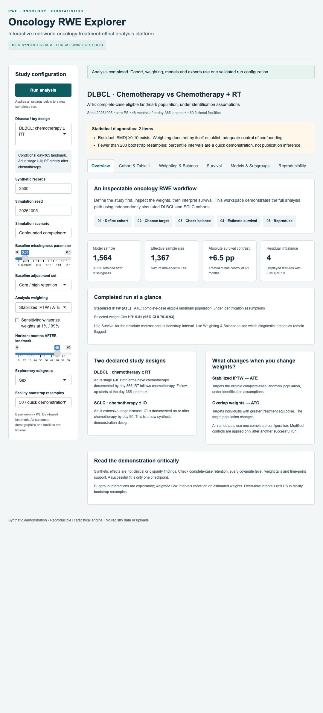

# Oncology RWE Explorer

[](https://github.com/yl8270/oncology-rwe-explorer/actions/workflows/validate.yml)

**An interactive real-world oncology treatment-effect analysis platform built in R Shiny, demonstrated exclusively with independently authored synthetic data.**

**[Open the interactive demo](https://yl8270.github.io/oncology-rwe-explorer/)** — no R installation or sign-in required. The online edition runs the same R analysis engine inside your browser using Shinylive/WebR. The first visit downloads the R runtime and packages; allow the app to finish loading before clicking **Run analysis**. Start with the default 2,500 records and 50 bootstrap resamples; larger runs depend on your device's memory and speed.

Designed as a biostatistics / real-world evidence portfolio: inspect the cohort definition, compare baseline characteristics, diagnose weighting, estimate conditional survival, and examine model assumptions before interpreting a result. No NCDB records, private notebook outputs or patient data are included or required. There is no data-upload interface.



## A five-minute walkthrough

1. Run the default DLBCL example and inspect cohort lineage and retention.
2. Compare unweighted and IPTW curves; inspect residual balance before interpreting the survival contrast.
3. Switch to overlap weights and explain why the target changes from ATE to ATO.
4. Try the null or poor-overlap scenario and inspect the diagnostics.
5. Download the HTML report and analysis bundle, then replay `config.json` from the command line.

The project demonstrates study design, transparent weighting, clustered survival inference and reproducible reporting. Simulated effect sizes are not clinical findings.

## Quick start

R 4.4 or newer is recommended. Open a terminal in the repository folder:

```sh
Rscript scripts/install_dependencies.R
Rscript -e "shiny::runApp('.', host='127.0.0.1', port=3838)"
```

Open `http://127.0.0.1:3838`, select a design, then click **Run analysis**. The default run generates 2,500 fictional records, fits the core PS model, applies stabilized IPTW and performs 50 facility bootstrap resamples. Use 200 resamples for a more stable demonstration CI. Changing controls leaves the last completed results visible until the next successful run; downloads always match the displayed run.

The app needs `shiny`, `survival`, `ggplot2`, `jsonlite`, `htmltools` and `zip`; tests use `testthat`. Installation occurs only when you explicitly run the installation script. The analysis itself makes no external data calls. `docs/package_versions.json` records the environment used for local validation. The generator fixes Mersenne-Twister / Inversion / Rejection locally and restores the caller RNG state and algorithm. Seed reproducibility assumes the same R/package versions; an exact cross-version numeric guarantee is not claimed.

## What you can explore

| Workspace | Features |
|---|---|
| Overview | declared study designs, ATE/ATO explanation, completed-run summary and analysis navigation |
| Cohort & Table 1 | before/excluded/after flow; landmark disposition; core/expanded complete-case retention; baseline Table 1 and missingness |
| Weighting & Balance | logistic PS with spline age; stabilized IPTW and binary overlap weights; raw PS overlap; level-specific Love plot; weight tails; arm-specific ESS |
| Survival | unweighted and selected-weight KM on one sample; observed risk counts and weighted risk mass; fixed-time survival and absolute difference; facility bootstrap with PS refitting |
| Models & Subgroups | unadjusted, covariate-adjusted and weighted Cox; facility-clustered sandwich intervals; exploratory PH diagnostic; pooled treatment × subgroup interaction |
| Reproducibility | config/seed/software manifest, QC checks, standalone HTML report, synthetic CSV, analysis ZIP with four vector PDFs and bootstrap failure reasons |

**Simulation scenarios:** confounded comparison, no treatment effect, poor overlap, and a time-varying treatment effect. The missingness parameter demonstrates sample retention tradeoffs. The stress scenarios can correctly fail when PS separation or model non-estimability occurs; no silent clipping or fallback model conceals those failures.

## Study designs and estimands

| Preset | Eligibility and treatment | Analysis time zero | Default survival horizon |
|---|---|---|---|
| DLBCL | adults, stage I–II; chemotherapy documented by day 365 in both arms; treated arm additionally has RT after chemotherapy and by day 365 | day 365; observed follow-up strictly beyond landmark | 48 months **after** landmark, approximately 5 years after diagnosis |
| Extensive-stage SCLC | adults, extensive-stage; chemotherapy by day 90; treated arm additionally has IO on/after chemotherapy and by day 90 | day 90; observed follow-up strictly beyond landmark | 18 months **after** landmark |

These are **conditional landmark comparisons**. The SCLC day-90 definition is a new portfolio design, not a claim about what the original notebook or a published paper specified. DLBCL preserves the original symmetric ascertainment idea while resolving its month/day boundary ambiguity. Missing treatment status, invalid survival and exact-boundary follow-up are excluded with visible counts. No missing outcome is replaced with zero.

- **Stabilized IPTW:** ATE target in the eligible complete-case landmark cohort, subject to identification assumptions. Optional 1st/99th percentile **winsorization** is a separately labeled sensitivity; it is not case trimming and changes the weighting scheme.
- **Overlap weighting:** ATO target in the overlap population. Choosing it changes the estimand. Only binary comparisons are implemented.
- **Unweighted:** descriptive treatment association. The sample still uses the chosen adjustment set's complete cases to permit same-sample comparisons.

Core variables are age (natural spline, 3 df), sex, simulated race/ethnicity, comorbidity, stage when variable, and diagnosis year. Expanded models add insurance, simulated area income and facility type. Covariates are defined before treatment; outcomes and treatment timing never enter PS. Neither design estimates a diagnosis-time causal treatment effect simply by applying weights.

## Statistical interpretation

Table 1 uses observed arm counts and weighted percentages rather than presenting fractional pseudo-counts as people. Category percentages use nonmissing denominators; missing percentages use all in the arm. Balance reports every categorical level and a fixed unweighted pooled SD, including variables outside the fitted core PS and spline-age features. A diagnostic threshold does not prove absence of confounding.

Weighted KM curves are point estimates. Fixed-time survival CIs resample fictional facilities and refit the PS in every resample; insufficient successful resamples are reported and CIs withheld. Fixed-time results also require at least 10 observed at risk and risk-set ESS ≥5 in each arm; unsupported tails are withheld. These thresholds are explicit demo guardrails, not universal reporting standards.

Cox models use Efron ties and facility-clustered sandwich covariance. Weighted Cox intervals condition on estimated weights; they do not incorporate PS-estimation uncertainty. The covariate-adjusted HR and marginal weighted working-model HR need not match. The generator's conditional HR is not a target for the marginal weighted HR. The Schoenfeld PH diagnostic is exploratory and does not have a cluster/PS-calibrated p value. Subgroup estimates use a single pooled interaction model with global weights; they are exploratory, unadjusted for multiplicity, and are not independently re-estimated subgroup ATEs.

The generator uses fictional facility clusters and plausible-looking toy distributions; no empirical source was used to calibrate them. Simulation truth is for software validation, not clinical interpretation. Causal language would additionally require consistency, exchangeability, positivity and appropriate censoring assumptions in an actual study.

## Reproduce and test without Shiny

```sh
# Regenerate the two public demo CSVs and their provenance manifests.
Rscript scripts/generate_synthetic.R

# Run the default analysis and export tables, synthetic data and vector figures.
Rscript scripts/run_example.R

# Replay a configuration from a downloaded analysis bundle.
Rscript scripts/run_example.R path/to/config.json outputs/replayed

# Statistical and server tests.
Rscript scripts/validate.R

# Independent simulation validation against known conditional truth and null.
Rscript scripts/validate_simulation.R
```

The app generates data internally; it does not import the bundled CSVs. CSVs are inspectable examples of the public generator. Downloaded raw and analytic CSVs remain completely synthetic. Analysis bundles include `config.json`, `manifest.json`, cohort/missingness/retention tables, Table 1, balance/ESS, survival/risk/CI tables, Cox/PH/subgroup estimates and notes. Reports display survival percentages and percentage-point contrasts while CSVs retain unrounded numeric estimates. The bundle also records each unsuccessful bootstrap attempt and includes four vector PDFs. Figures use `ggplot2`; PDF export preserves vector text.

## Project structure

```text
app.R                       Shiny entrypoint
R/
  config.R                  design and estimand contract
  synthetic.R               standalone synthetic generator
  cohort.R                  schema, eligibility, timing and flow
  weighting.R               complete cases, logistic PS, weights and ESS
  descriptives.R            Table 1, missingness and balance
  survival.R                KM, bootstrap, Cox, PH and interactions
  pipeline.R                validated run and reproducible exports
  plots.R                   restrained scientific graphics
  presentation.R            readable tables and escaped standalone HTML report
  overview.R                study guide and completed-run summary
  modules.R                 five namespaced analysis workspaces
  app_factory.R             UI and session-local orchestration
  load.R                    explicit source order
data/synthetic/             generated demo CSVs + provenance
docs/                       audit, architecture, methods, QA and resume copy
scripts/                    installation, generation, replay and validation
tests/testthat/             independent statistical checks + Shiny tests
www/style.css               responsive presentation
.github/workflows/           statistical CI + GitHub Pages deployment
outputs/                    generated locally; ignored by Git
```

## Source fidelity and portfolio presentation

The project was rebuilt after a static code-only audit of four private oncology notebooks. Their patient-level files, outputs, absolute paths and original notebook code are excluded. The public repository retains the statistical ideas with explicitly documented corrections and scope changes. See [Notebook audit](docs/NOTEBOOK_AUDIT.md), [Architecture](docs/ARCHITECTURE.md), [Methods](docs/METHODS.md), [Validation](docs/VALIDATION.md), and [Resume description](docs/RESUME_PROJECT.md).

The [online demo](https://yl8270.github.io/oncology-rwe-explorer/) is published with GitHub Pages and [Posit Shinylive](https://posit-dev.github.io/r-shinylive/). R runs in the visitor's browser through WebAssembly; GitHub serves static assets rather than an R server. The generator and statistical pipeline are shared with the native R version. Browser and native package versions differ and are recorded in each run manifest. See [Deployment](docs/DEPLOYMENT.md) for build instructions and runtime limitations. The source is published at [yl8270/oncology-rwe-explorer](https://github.com/yl8270/oncology-rwe-explorer).

Official implementation references: [R survival Cox documentation](https://stat.ethz.ch/R-manual/R-devel/library/survival/html/coxph.html), [weighted survival documentation](https://stat.ethz.ch/R-manual/R-devel/library/survival/html/survfit.formula.html), and [Posit Shiny modules](https://shiny.posit.co/r/articles/improve/modules/).

License: MIT for this newly authored project. No license to private source notebooks or registry materials is implied.
